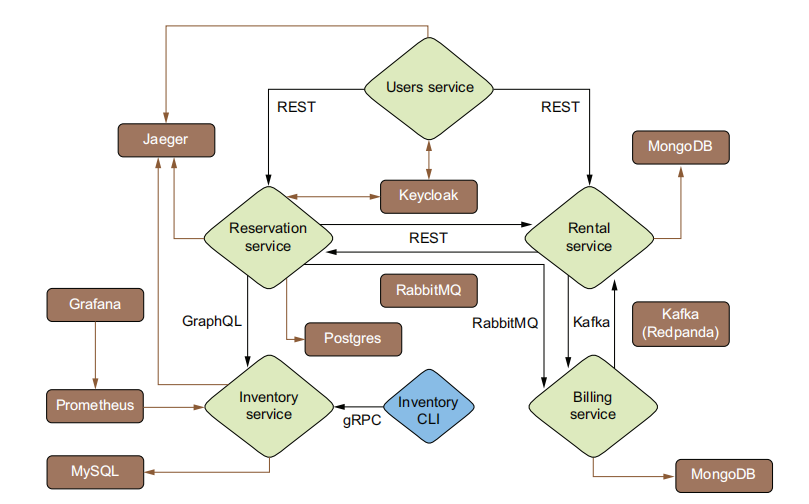

### Book: [Quarkus in Action](Quarkus-in-Action-Red-Hat-Developer-ebook-final.pdf)



### Start containers that don’t have Dev Services:

```shell
    docker compose -f docker-compose-files/docker-compose-observability.yml up
```    

```shell
    docker compose -f docker-compose-files/docker-compose-observability.yml down
```
